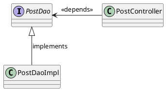
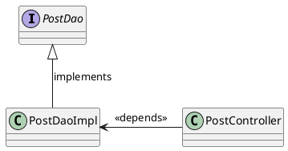

##Positive example of Dependency Inversion

```puml
@startuml
interface PostDao {

}
class PostDaoImpl {

}
PostDao <|-- PostDaoImpl: implements
class PostController {

}

PostDao <- PostController: <<depends>>

@enduml
```
##Negative example of Dependency Inversion

```puml
@startuml
interface PostDao {

}
class PostDaoImpl {

}
PostDao <|-- PostDaoImpl: implements
class PostController {

}

PostDaoImpl <- PostController: <<depends>>

@enduml
```