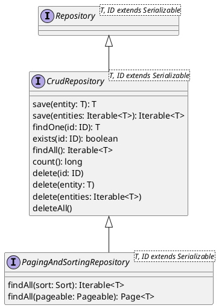
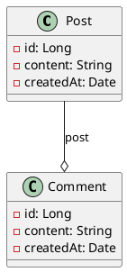
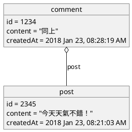
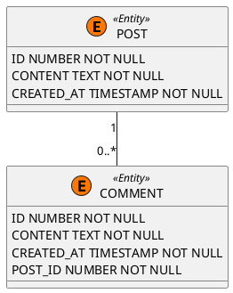

### Repository example

```plantuml
@startuml
interface Repository<T, ID extends Serializable>{

}

interface CrudRepository<T, ID extends Serializable> {
    save(entity: T): T
    save(entities: Iterable<T>): Iterable<T>
    findOne(id: ID): T
    exists(id: ID): boolean
    findAll(): Iterable<T>
    count(): long
    delete(id: ID)
    delete(entity: T)
    delete(entities: Iterable<T>)
    deleteAll()
}
Repository <|-- CrudRepository

interface PagingAndSortingRepository<T, ID extends Serializable> {
    findAll(sort: Sort): Iterable<T>
    findAll(pageable: Pageable): Page<T>
}
CrudRepository <|-- PagingAndSortingRepository
@enduml
```

### Object model

```plantuml
@startuml
class Post {
    -id: Long
    -content: String
    -createdAt: Date
}
class Comment {
    -id: Long
    -content: String
    -createdAt: Date
}

Post --o Comment: post
@enduml
```

```plantuml
@startuml
object post {
    id = 2345
    content = "今天天氣不錯！"
    createdAt = 2018 Jan 23, 08:21:03 AM
}

object comment {
    id = 1234
    content = "同上"
    createdAt = 2018 Jan 23, 08:28:19 AM
}

comment o-- post: post

@enduml
```

### Relational model

```plantuml
@startuml
class POST << (E,#FF7700) Entity >>{
    ID NUMBER NOT NULL
    CONTENT TEXT NOT NULL
    CREATED_AT TIMESTAMP NOT NULL
}

class COMMENT << (E,#FF7700) Entity >>{
    ID NUMBER NOT NULL
    CONTENT TEXT NOT NULL
    CREATED_AT TIMESTAMP NOT NULL
    POST_ID NUMBER NOT NULL
}

POST "1" -- "0..*" COMMENT
@enduml
```